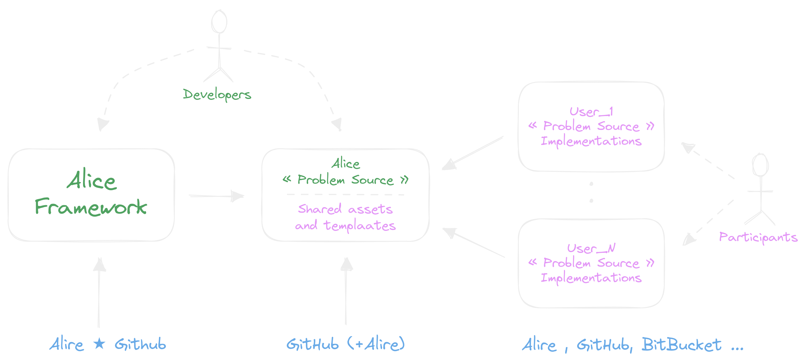
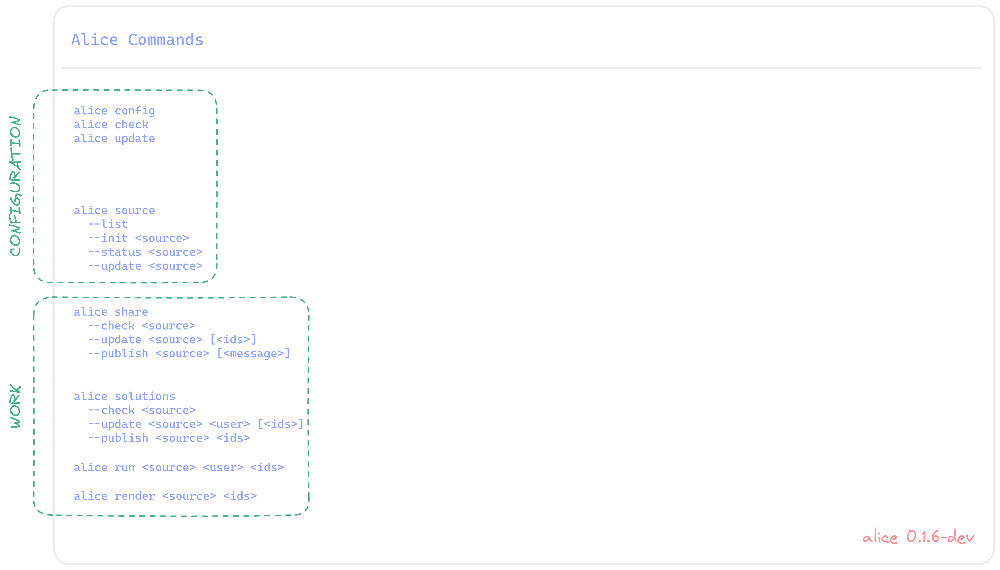
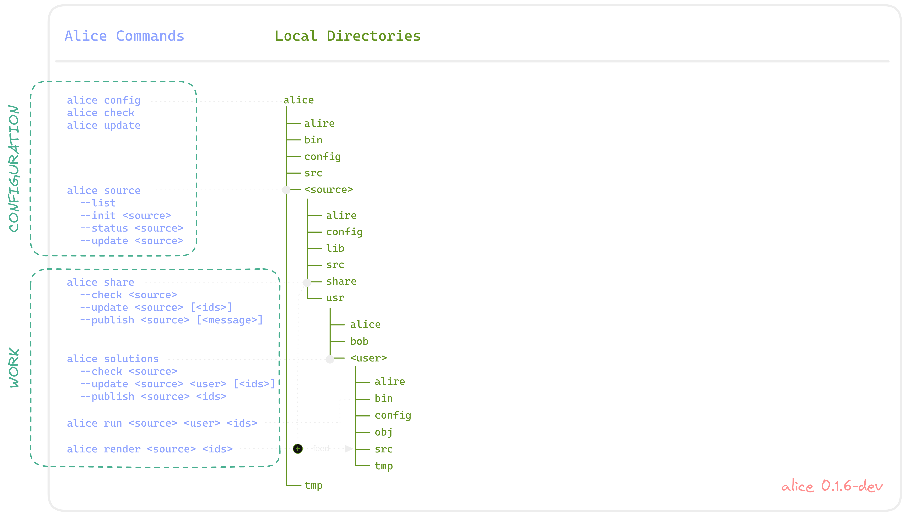
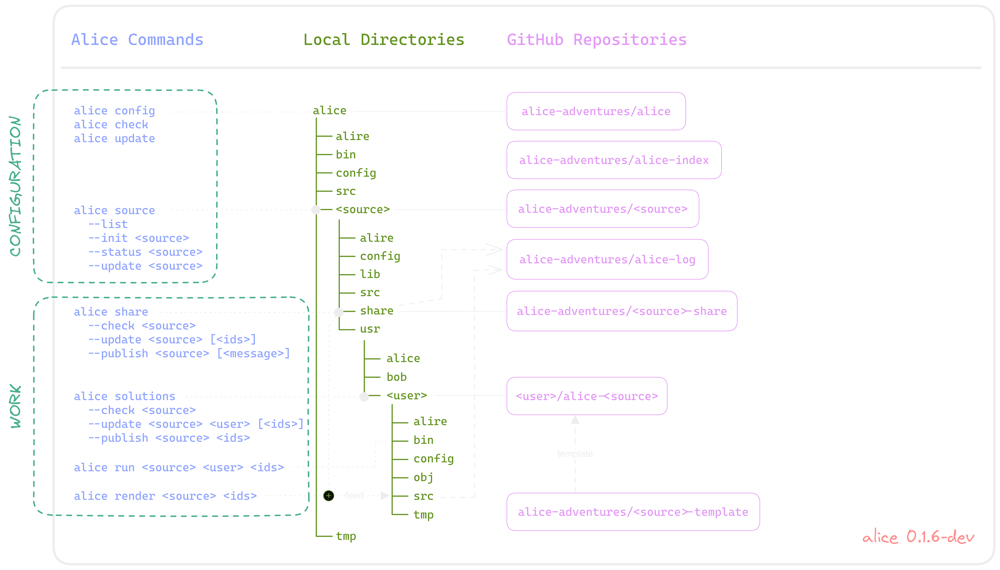
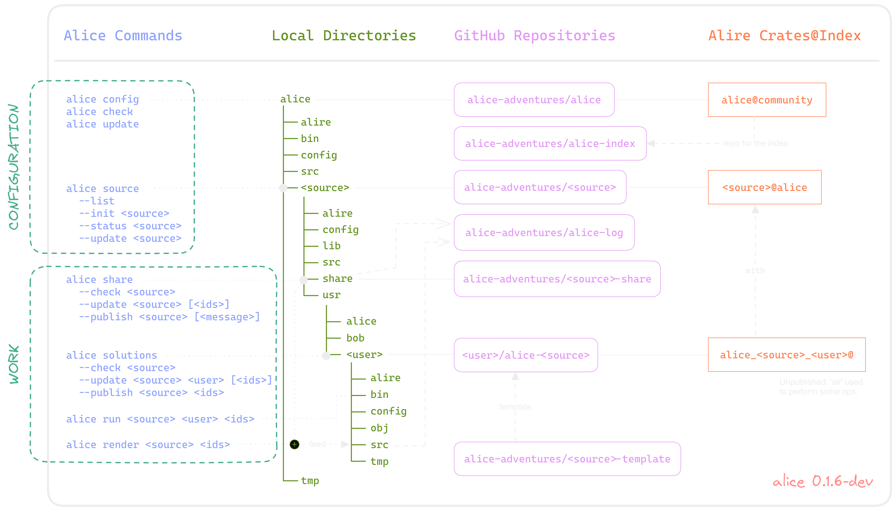

## Alice
# Architecture

---

## Alice
# Architecture

  * Based on the command "`alice`", which allows

---

## Alice
# Architecture

  * Based on the command "`alice`", which allows

    + **Configuration**

      - setup the Participant profile
      - setup the Problem Source for the Participant

---

## Alice
# Architecture

  * Based on the command "`alice`", which allows

    + **Configuration**
      - setup the Participant profile
      - setup the Problem Source for the Participant

    + **Work**
      - share assets for a Problem Source
      - share solutions of problems or puzzles

— • —

---

## Alice
## Repositories

---

### Alice
#### Architecture

---

### Alice
#### Architecture

---

### Alice
#### Architecture

---

### Alice
#### Architecture

