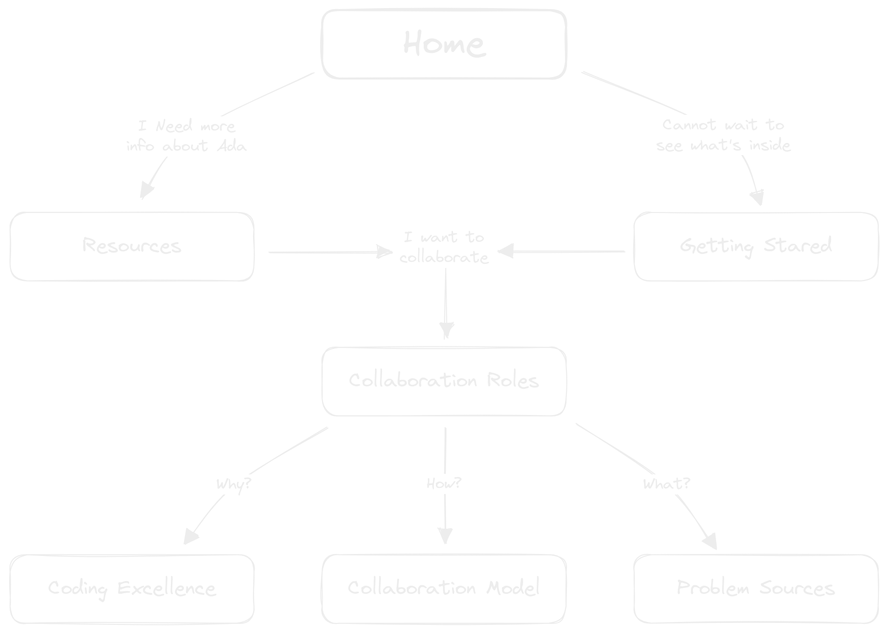
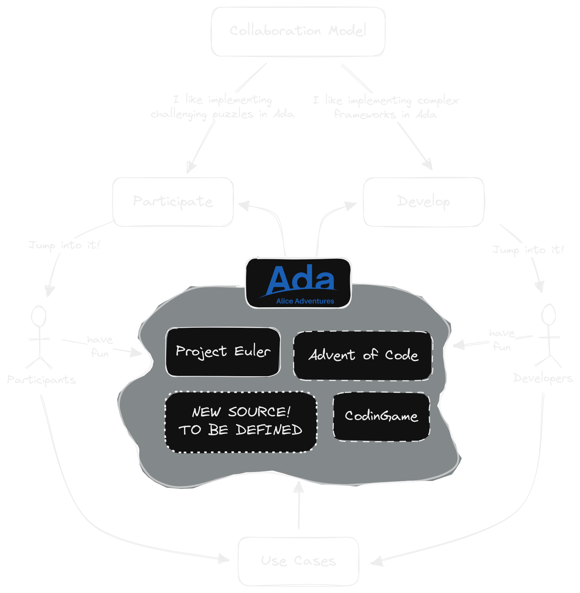

# Welcome to Alice

## —

### *Aventures for Learning and*

### *Inspiring Coding Excellence*

---

### What is Alice?

[Wiki: Map of contents](https://github.com/alice-adventures/alice/wiki/Map-of-Contents)

---

---

## *Adventures for*

---

## *Adventures for*

  * **Working with several Problem Sources**

---

## *Adventures for*

  * **Working with several Problem Sources**

    + *Project Euler*
    + *Advent of Code*
    + *Check-io*
    + *CodinGame*
    + *Rosetta Code*
    + *Exercism*
    + ...

note: my note

---

## *Adventures for*

  * **Working with several Problem Sources**

    + *Project Euler*
    + *Advent of Code*
    + *Check-io*
    + *CodinGame*
    + *Rosetta Code*
    + *Exercism*
    + ...

#
#### — & —
#### Brand new Problem Source

  * made by the Ada community for the Ada language
  * real-time, critical, high integrity
  * embedded, distributed
  * *anything specific for Ada*

---

## *Adventures for*

  * Literally thousands of puzzles and problems to solve

---

## *Adventures for*

  * Literally thousands of puzzles and problems to solve

  * Huge variety of problem domains

---

## *Adventures for*

  * Literally thousands of puzzles and problems to solve

  * Huge variety of problem domains

  * Wide range of algorithms required

---

## *Adventures for*

  * Literally thousands of puzzles and problems to solve

  * Huge variety of problem domains

  * Wide range of algorithms required

  * **Participants** can use 3 scenarios

    + specific CLI & GUI interfaces (PE, CG, Cio)
    + minimum interface for sharing (AoC)
    + absolute freedom for coding (RC)

---

## *Adventures for*

  * Literally thousands of puzzles and problems to solve

  * Huge variety of problem domains

  * Wide range of algorithms required

  * **Participants** can use 3 scenarios

    + specific CLI & GUI interfaces (PE, CG, Cio)
    + minimum interface for sharing (AoC)
    + absolute freedom for coding (RC)

  * **Developers** can work in

    + implement interfaces using different frameworks
    + game engines (CG)
    + tools to share and compare solutions
    + porting to new platforms

— • —

---

## *Learning*

  * By example, with solutions shared by other Participants

---

## *Learning*

  * By example, with solutions shared by other Participants

  * Practicing new concepts or algorithms (Participants)

---

## *Learning*

  * By example, with solutions shared by other Participants

  * Practicing new concepts or algorithms (Participants)

  * Implementing new tools (Developers)

---

## *Learning*

  * By example, with solutions shared by other Participants

  * Practicing new concepts or algorithms (Participants)

  * Implementing new tools (Developers)

  * Specific Ada features

---

## *Learning*

  * By example, with solutions shared by other Participants

  * Practicing new concepts or algorithms (Participants)

  * Implementing new tools (Developers)

  * Specific Ada features
    + type system
    + generics
    + tasks
    + concurrency

— • —

---

### *And Inspiring*
## *Coding Excellence*

  * **Programming principles**: Clean Code, SOLID..

---

### *And Inspiring*
## *Coding Excellence*

  * **Programming principles**: Clean Code, SOLID..

    + software design
    + expressiveness & style
    + maintainability & modularity
    + efficiency & resource optimization

---

### *And Inspiring*
## *Coding Excellence*

  * **Programming principles**: Clean Code, SOLID..

    + software design
    + expressiveness & style
    + maintainability & modularity
    + efficiency & resource optimization

  * **Design by Contract**

---

### *And Inspiring*
## *Coding Excellence*

  * **Programming principles**: Clean Code, SOLID..
    + software design
    + expressiveness & style
    + maintainability & modularity
    + efficiency & resource optimization

  * **Design by Contract**

    + pre-conditions, post-conditions, invariants
    + assertions

---

### *And Inspiring*
## *Coding Excellence*

  * **Programming principles**: Clean Code, SOLID..
    + software design
    + expressiveness & style
    + maintainability & modularity
    + efficiency & resource optimization

  * **Design by Contract**

    + pre-conditions, post-conditions, invariants
    + assertions

  * **Correctness by Construction**

---

### *And Inspiring*
## *Coding Excellence*

  * **Programming principles**: Clean Code, SOLID..
    + software design
    + expressiveness & style
    + maintainability & modularity
    + efficiency & resource optimization

  * **Design by Contract**

    + pre-conditions, post-conditions, invariants
    + assertions

  * **Correctness by Construction**

    + SPARK proofs

— • —

---

### End

## —

#### Thanks for your time
